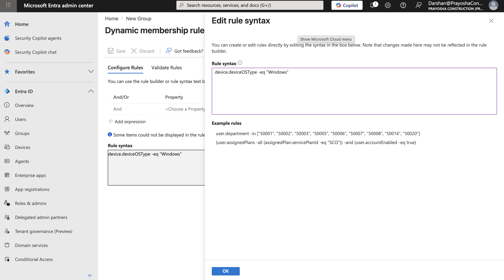
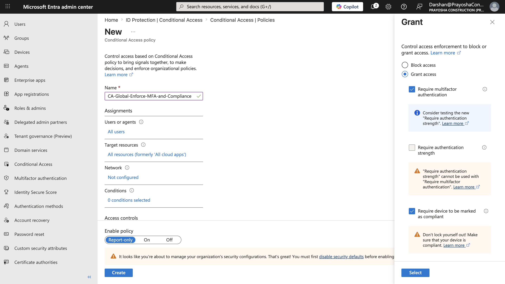
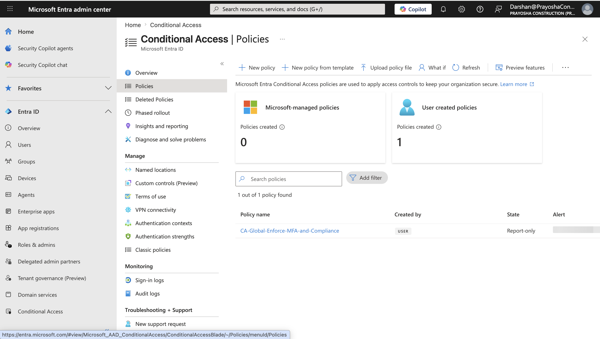
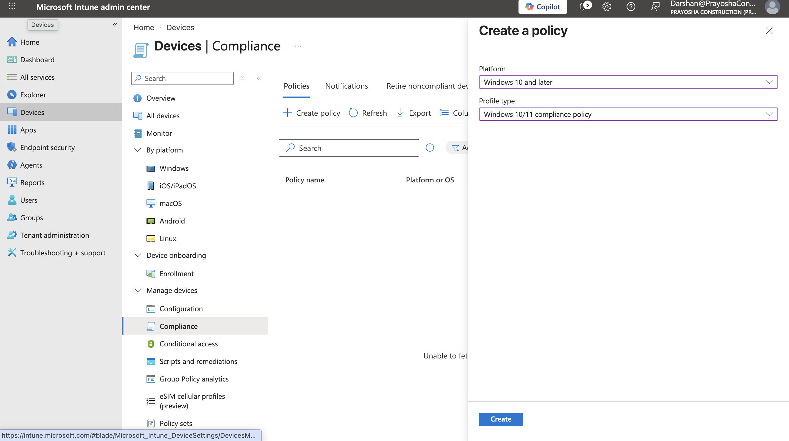
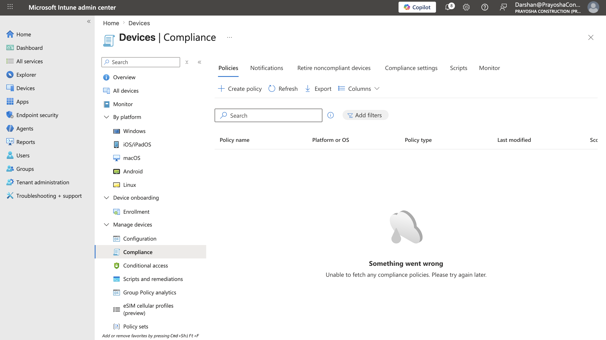

# Cloud-native enterprise endpoint lab

I built this project to show how to set up a cloud-only enterprise endpoint lab using Microsoft Entra ID and Microsoft Intune. 

For years, sysadmins and engineers tested corporate configurations in local virtual labs. You would run a physical hypervisor like ESXi or Hyper-V to host local domain controllers, DHCP, DNS, and SCCM servers. That setup requires a lot of RAM and disk space, and it doesn't match how modern fleets actually run. Today, devices connect directly to the internet from home or coffee shops without VPNs.

This repository moves away from local servers entirely. I replaced the local Active Directory with Microsoft Entra ID to handle identity globally over the internet. Instead of manual system imaging, Windows Autopilot dynamically configures devices when a user first signs in with their company credentials. Security policies check device health and compliance in real time before granting access to resources. Finally, we manage the entire fleet from the Intune admin center, which eliminates hypervisor overhead and server maintenance.

## Core components

This lab uses Microsoft Entra ID as the cloud identity provider to manage user accounts and device registration. For device configuration and security policies, Microsoft Intune is the mobile device management authority. 

Security follows a zero-trust model where we assume all networks are hostile and verify the user and device state before granting access. This is enforced through Conditional Access policies in Entra ID, which evaluate real-time signals (like whether a device is compliant in Intune) to block or allow connections. Within Intune, I configure settings using the Settings Catalog, which replaces traditional Active Directory Group Policy Objects.

## Deployment workflow

I configured the environment in four main stages.

### Phase 1: Identity and fleet inventory

First, I set up a fresh Microsoft Entra ID tenant and configured Intune. I created a dynamic device group named `Corp-Windows-Devices` so that any Windows machine registering with the tenant joins this group automatically.

To do this, I used the Entra ID rule builder to target devices with the `deviceOSType -eq "Windows"` property. This keeps the inventory updated without manual sorting.

<p align="center">
  
  <br>
  <em>Figure 1: Setting up the dynamic group rule to catch Windows endpoints automatically.</em>
</p>

<p align="center">
  
  <br>
  <em>Figure 2: The query syntax for targeting Windows devices.</em>
</p>

---

### Phase 2: Zero-trust access control

Next, I turned off the default security settings in Entra ID. Those defaults are okay for basic setups, but they prevent you from creating custom access policies.

With defaults disabled, I created a Conditional Access policy called `CA-Global-Enforce-MFA-and-Compliance`. This policy applies to all users and all cloud apps. It requires two things before granting access: multi-factor authentication (MFA) and a compliant device status verified by Intune.

<p align="center">
  
  <br>
  <em>Figure 3: Requiring MFA and compliant status in the policy settings.</em>
</p>

<p align="center">
  
  <br>
  <em>Figure 4: The active Conditional Access policy list in Entra ID.</em>
</p>

---

### Phase 3: Security baselines

To define what makes a device compliant, I created a Windows 10 and 11 compliance policy in Intune. I set the policy to verify that BitLocker encryption is active on the system drive, Microsoft Defender is running with the latest updates, the Windows Firewall is active across all network profiles, and hardware-level protections like Secure Boot and TPM 2.0 are enabled.

If a device misses any of these, the policy triggers a warning flow. The user gets an immediate email alert, and they have three days to resolve the issue. If the device remains non-compliant after three days, Intune marks it as such, and the Conditional Access policy blocks their access to company resources.

<p align="center">
  
  <br>
  <em>Figure 5: Setting compliance requirements in the Intune console.</em>
</p>

---

### Phase 4: Endpoint automation script

To automate security audits locally, I packaged and uploaded a PowerShell script to Intune.

When deploying the script, I selected the option to run it in a 64-bit PowerShell host. This is important because Intune's default agent often runs scripts in a 32-bit process. When a 32-bit process runs on 64-bit Windows, the operating system redirects file paths (from `System32` to `SysWOW64`) and registry paths (from `HKLM\Software` to `Wow6432Node`). Running the script in the native 64-bit context avoids these redirects, meaning the script can read the actual system files and registry entries directly.

<p align="center">
  
  <br>
  <em>Figure 6: Configuring the audit script deployment in the Intune console.</em>
</p>

## The compliance audit script

This is the PowerShell script I deploy to all machines in the `Corp-Windows-Devices` group. It checks disk space, verifies BitLocker status, and scans for unapproved applications.

```powershell
# Simple compliance audit script for Windows endpoints

$compliant = $true

# 1. Disk Space check (must have at least 20 GB free)
$drive = Get-CimInstance Win32_LogicalDisk -Filter "DeviceID='C:'"
$freeSpaceGB = $drive.FreeSpace / 1GB

if ($freeSpaceGB -lt 20) {
    Write-Warning "C: drive has less than 20 GB free space (Current: $([Math]::Round($freeSpaceGB, 2)) GB)"
    $compliant = $false
} else {
    Write-Output "Disk space OK: $([Math]::Round($freeSpaceGB, 2)) GB free"
}

# 2. BitLocker check (must be fully encrypted)
$bitlocker = Get-BitLockerVolume -MountPoint "C:" -ErrorAction SilentlyContinue
if (-not $bitlocker -or $bitlocker.VolumeStatus -ne "FullyEncrypted") {
    Write-Warning "BitLocker is not fully enabled on C:"
    $compliant = $false
} else {
    Write-Output "BitLocker status OK"
}

# 3. Blocked apps check
$blockedApps = @("uTorrent", "CCleaner", "TeamViewer", "Dropbox", "BitTorrent")
$registryPaths = @(
    "HKLM:\Software\Microsoft\Windows\CurrentVersion\Uninstall\*",
    "HKLM:\Software\Wow6432Node\Microsoft\Windows\CurrentVersion\Uninstall\*"
)

$installedApps = Get-ItemProperty -Path $registryPaths -ErrorAction SilentlyContinue | 
    Select-Object -ExpandProperty DisplayName -ErrorAction SilentlyContinue

$foundApps = @()
foreach ($app in $blockedApps) {
    if ($installedApps -like "*$app*") {
        $foundApps += $app
    }
}

if ($foundApps.Count -gt 0) {
    Write-Warning "Found blocked software: $($foundApps -join ', ')"
    $compliant = $false
} else {
    Write-Output "No blocked apps found"
}

# Exit code for Intune (0 = compliant, 1 = non-compliant)
if ($compliant) {
    Write-Output "Device is compliant."
    exit 0
} else {
    Write-Warning "Device is not compliant."
    exit 1
}
```
